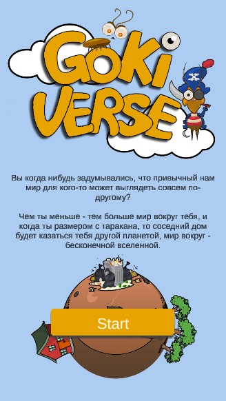

# CrazyBalls
Monster strike tribute 
Game was made for local GameJam

You will control team of cockroaches, fight different enemies and powerfull bosses.
Fights are turn based. Just make a swipe on the screen to shoot current unit in given direction.

Each cockroach has own characteristics, active and passive skills. 
Passive skill activates any time you collide with your teammates.
To unlock active skills you need to damage enemies.
During the level progress you will get rewards and by using them you can level up your cockroaches.

* [Gameplay video](https://drive.google.com/file/d/13V638P6k4zMki_x-wkjtW5q18lcqNSs6)
* [Android build](https://drive.google.com/file/d/1SUFWC1tPJUDAZkUtSjq_QsfqxT5LxqQX)